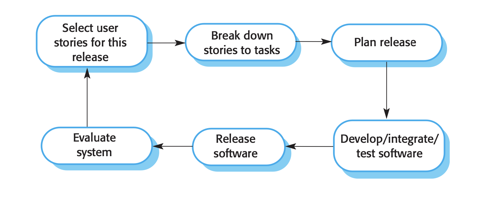

Agile method 사용

매주 user story (sprint) 만들고
task 쪼개고 
task 작성법
: test - driven method 로 작성
함수나 클래스 만드는 족족 test 가능하게 하고 
코드는 개선 보이는 족족 refactoring 하고 

매주 회의 때 (Review sprint)
1. code review 
2. semi sprint day(1주로 줄임 우리 스프린트는 )
3. 목표 달성 check velocity check 

scrum 을 일주일에 두번 정도 하면 좋을 것 같은데
아마 10분 정도 씩 수, 금 물어보기 
밤 or 오전 

scrum : 
1. review process, 
2. re-prioritize work ,
3. describe the progress since the last meeting 
4. bring up the problem that has been arisen
5. state what is the plan for the next days

scrum board 는 github board 활용 

(taks 작성 예시 -product backlog)
test - driven 방식으로 작성 

Sprint backlog 작성 예시 

유저스토리, 줄글 형식 

